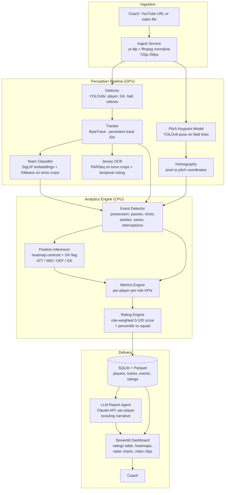

# Solution Blueprint: ScoutTrainer — AI Football Scouting from Video

## 1. Problem Statement

Youth football coaches cannot objectively evaluate every kid on the pitch at once. ScoutTrainer ingests match video of kids playing football (any source — YouTube link, downloaded file, phone recording), detects and tracks every player, identifies them by jersey number, infers each player's position (attacker / midfielder / defender / goalkeeper), and rates their performance **against the expectations of their own position** on a 0–100 scale with per-skill sub-scores. The coach receives a dashboard and an AI-written scouting report per player.

**Scope:** single-machine MVP for one academy; one match video processed at a time (batch, not real-time).
**Not covered:** live/real-time analysis, multi-camera fusion, biometric data, comparison across academies, mobile app.

## 2. AI Approach

**Chosen approach:** Computer-vision perception pipeline (detection → tracking → OCR → homography) feeding a **deterministic analytics/rating engine**, topped with an **LLM agent** that composes the scouting narrative.

**Why this approach:**
- Player rating requires *measurable evidence* (distance covered, pass completions, tackles, saves). A CV pipeline produces those measurements; an end-to-end "video-in, score-out" neural model would be an unexplainable black box a coach can't trust — and there is no labeled dataset of "kid performance scores" to train it on.
- Position-specific rating is a *rules-and-weights* problem once metrics exist. Deterministic scoring is transparent, tunable by the coach, and defensible ("he scored 78 because he won 6 of 8 duels"), which is exactly what scouting needs.
- The LLM layer is used only where language is the deliverable (scouting report), not for measurement — keeping hallucination risk away from the numbers.

**Approaches considered and ruled out:**

| Approach | Why ruled out |
|----------|--------------|
| End-to-end video classification ("rate this player" CNN/transformer) | No training data exists; unexplainable; can't justify a score to a coach |
| Pure LLM/VLM on video frames (e.g., multimodal LLM watches the match) | Cannot track 22 players across 90k frames; costs explode; numeric outputs are hallucination-prone |
| Manual annotation tool (coach tags events himself) | Doesn't scale; defeats the purpose of automation |
| Commercial APIs (Veo, Hudl) | Closed, expensive, no position-specific youth scoring; this is a build-vs-buy where the interview asks for a build |

## 3. System Architecture



**Architecture narrative:** Video enters once and is normalized. The GPU perception pipeline converts pixels into structured facts: *who* (track ID + jersey number + team), *where* (pitch coordinates via homography), and *what* (ball possession and events). The CPU analytics engine turns those facts into role-aware metrics and a transparent 0–100 rating. Everything lands in SQLite/Parquet; a Streamlit dashboard and an LLM report writer read from storage — they never touch raw video, so the expensive perception step runs exactly once per match.

## 4. Component Breakdown

### Ingest Service
- **Role:** Accept a YouTube URL or local file; produce one normalized MP4 (720p, 25 fps, H.264).
- **Technology:** `yt-dlp` + `ffmpeg-python`.
- **Why this tech:** yt-dlp is the de-facto standard for URL video download; ffmpeg normalization makes every downstream model see identical input regardless of source quality.
- **Key interfaces:** In: URL/path. Out: `data/matches/{match_id}/video.mp4` + metadata JSON (fps, duration, resolution).
- **Failure modes:** Broken URL or DRM-protected stream → job fails fast with a clear error before any GPU time is spent.

### Detector (YOLOv8x)
- **Role:** Per-frame bounding boxes for `player`, `goalkeeper`, `ball`, `referee`.
- **Technology:** Ultralytics YOLOv8x fine-tuned on the Roboflow *football-players-detection* dataset.
- **Why this tech:** Best accuracy/speed trade-off with a pretrained football checkpoint available — no annotation work needed for MVP.
- **Key interfaces:** In: frames (batched). Out: detections `(frame, class, bbox, conf)` → Tracker.
- **Failure modes:** Missed ball detections in long shots → event detector interpolates ball position; degraded but functional.

### Tracker (ByteTrack)
- **Role:** Stitch per-frame detections into persistent per-player track IDs across the match.
- **Technology:** ByteTrack via the `supervision` library.
- **Why this tech:** ByteTrack's two-stage association keeps IDs through occlusions (kids cluster around the ball constantly) better than SORT/DeepSORT at this scale.
- **Key interfaces:** In: detections. Out: tracklets `(track_id, frame, bbox)` → Team Classifier, OCR, Event Detector.
- **Failure modes:** ID switches after pile-ups → jersey OCR re-anchors identity (see below), so a switch costs seconds of attribution, not the whole match.

### Team Classifier
- **Role:** Assign each track to Team A / Team B / referee.
- **Technology:** SigLIP image embeddings of torso crops + UMAP + KMeans (k=2), majority-voted per track.
- **Why this tech:** Zero-shot — works on any two kits without training; robust to lighting vs. raw color histograms.
- **Key interfaces:** In: torso crops per track. Out: `track_id → team`.
- **Failure modes:** Similar kit colors → dashboard flags low cluster separation and asks the coach to confirm team assignment manually (one click).

### Jersey OCR
- **Role:** Map track IDs to jersey numbers → roster names.
- **Technology:** PARSeq scene-text recognition on torso crops, sampled 2×/sec per track, with **temporal majority voting** across the whole track.
- **Why this tech:** PARSeq handles curved/occluded digits far better than Tesseract; voting across hundreds of crops turns a 60% per-frame read rate into >95% per-track accuracy.
- **Key interfaces:** In: torso crops. Out: `track_id → jersey_number`; joined with coach-supplied roster CSV → player name.
- **Failure modes:** Number never visible (kid faces camera all match) → player shown as "Unknown #?" with a thumbnail; coach labels once in the dashboard and the mapping persists.

### Pitch Keypoint Model + Homography
- **Role:** Map pixel coordinates to real pitch coordinates (meters) so speed, distance, and zones are physically meaningful.
- **Technology:** YOLOv8-pose fine-tuned on the Roboflow *football-field-detection* keypoint dataset (32 pitch landmarks) + OpenCV `findHomography`, re-estimated every 30 frames (camera pans).
- **Why this tech:** Keypoint-based homography works on a single moving camera — the exact "any video" constraint; no calibration needed.
- **Key interfaces:** In: frames. Out: per-window 3×3 homography matrix → Analytics.
- **Failure modes:** Too few visible landmarks (extreme zoom) → fall back to last valid homography; metrics tagged lower-confidence for those windows.

### Event Detector
- **Role:** Derive football events from tracks + ball position: possession (nearest player within radius, with hysteresis), passes (possession change, same team), interceptions/losses (possession change, other team), shots (ball velocity vector toward goal from attacking zone), tackles/duels (two opposing tracks converge on ball; winner = next possessor), saves (GK possession/deflection immediately after a shot), clearances, dribbles (possession retained past an opponent).
- **Technology:** Pure Python/NumPy rule engine over the track + homography tables. No ML.
- **Why this tech:** Rules over clean tracking data are transparent, debuggable, and tunable per age group — a learned event model needs labels we don't have.
- **Key interfaces:** In: tracklets, ball track, homography, teams. Out: `events` table `(t, type, player, success, x, y)`.
- **Failure modes:** Missed ball frames → linear interpolation up to 1 s; longer gaps mark possession "unknown" rather than guessing.

### Position Inferencer
- **Role:** Classify each player's role for the match: GK / DEF / MID / ATT.
- **Technology:** GK comes from the detector class + penalty-box dwell time. Outfield roles from the player's position heatmap centroid along the pitch's long axis (team-attack-direction normalized), split by learned tercile boundaries.
- **Why this tech:** In youth football formations are fluid; average occupied zone is the honest signal. Coach can override any assignment in the dashboard.
- **Key interfaces:** In: pitch-coordinate tracks. Out: `player → role (+ confidence)`.
- **Failure modes:** Kid roams everywhere → low confidence flag; rated under the role with the higher score (benefit of the doubt, disclosed in the report).

### Metrics Engine
- **Role:** Compute per-player KPIs, filtered by role relevance.
- **Technology:** pandas over the events/tracks tables.
- **Key metrics per role:**
  - **ATT:** shots, shots on target, goals, dribble success %, touches in final third, chances created (pass leading to shot), off-ball runs (high-speed runs into box).
  - **MID:** pass completion %, forward-pass %, ball recoveries, distance covered, progressive carries, possession retention under pressure.
  - **DEF:** duels won %, interceptions, clearances, blocks, recovery speed (sprint after loss), positioning error (distance from defensive line when opponent attacks).
  - **GK:** saves, save %, goals conceded, distribution accuracy, sweeping actions outside box, positioning vs. shot origin.
  - **All roles:** top speed, distance, sprints, involvement rate (touches/minute).
- **Failure modes:** Small sample (kid played 10 min) → metrics per-90-normalized and flagged low-sample.

### Rating Engine
- **Role:** One 0–100 rating per player *for their role*, plus sub-scores.
- **Technology:** Each KPI → percentile within squad (and, later, within age-group history) → weighted sum with role-specific weights stored in `weights.yaml` (coach-editable). Sub-scores grouped as Attacking / Defending / Physical / Technical.
- **Why this tech:** Percentile-within-cohort avoids absolute thresholds that don't exist for kids; YAML weights make the scoring philosophy explicit and adjustable — the single most defensible design choice in an interview.
- **Key interfaces:** In: metrics table. Out: `ratings` table `(player, role, overall, sub_scores JSON, evidence JSON)`.
- **Failure modes:** Squad too small for percentiles (<6 players/role) → fall back to min-max scaling across all outfield players.

### LLM Report Agent
- **Role:** Turn each player's metrics + rating + top video moments into a 150-word scouting note (strengths, weaknesses, development suggestion).
- **Technology:** Claude API (claude-sonnet), one structured-prompt call per player; input is *only* the computed metrics JSON — the model never invents numbers.
- **Why this tech:** Language generation is the one task where an LLM beats templates; grounding it strictly in computed metrics keeps it honest.
- **Key interfaces:** In: ratings + evidence JSON. Out: markdown note stored in DB.
- **Failure modes:** API unavailable → dashboard falls back to a template-based note; ratings unaffected.

### Storage (SQLite + Parquet)
- **Role:** `matches`, `players`, `events`, `metrics`, `ratings` in SQLite; bulky per-frame tracks in Parquet.
- **Why this tech:** Zero-ops local MVP; Parquet keeps 90k-frame track tables compact and pandas-fast. Swap to Postgres unchanged via SQLAlchemy when going multi-user.

### Streamlit Dashboard
- **Role:** Coach UI — upload/URL input, processing progress, squad rating table, per-player page (radar chart, heatmap, event timeline, auto-cut video clips of key moments, LLM note), CSV export, manual overrides (team, jersey, role).
- **Technology:** Streamlit + Plotly + `mplsoccer` for pitch visualizations.
- **Why this tech:** Fastest path to a polished demo; ideal for an interview presentation.
- **Failure modes:** Long processing → job runs in a background worker; dashboard polls status, never blocks.

## 5. Data Flow

**Primary happy path — "analyze this match":**

1. Coach opens the dashboard, pastes a YouTube URL (or picks a file) and uploads the roster CSV (`jersey_number, name, age`).
2. Ingest Service downloads/normalizes to 720p 25 fps MP4, writes match metadata, enqueues a processing job.
3. Perception worker streams frames in batches of 32 through YOLOv8x → detections.
4. ByteTrack links detections into tracklets; every 12th frame, torso crops go to the Team Classifier and Jersey OCR queues.
5. In parallel, the pitch keypoint model estimates a fresh homography every 30 frames.
6. Temporal voting finalizes `track → team` and `track → jersey → name`; tracks are projected to pitch coordinates and written to Parquet.
7. Event Detector runs over the full track table, emitting the events table.
8. Position Inferencer assigns GK/DEF/MID/ATT per player; Metrics Engine computes role-filtered KPIs; Rating Engine writes 0–100 ratings + evidence.
9. LLM Report Agent generates one scouting note per player from the metrics JSON.
10. Dashboard flips job status to "done"; coach sees the squad table ranked by rating and drills into any kid.

**Secondary flow — coach corrections:**

1. Coach fixes a wrong jersey/team/role in the dashboard.
2. Correction is stored as an override row (raw pipeline output never mutated).
3. Metrics → Rating → Report re-run for affected players only (seconds, no video reprocessing).

**Secondary flow — failure/retry:**

1. Any stage exception marks the job `failed` with stage + reason; artifacts of completed stages are kept.
2. Retry resumes from the last completed stage (stages are idempotent, keyed by `match_id`).

## 6. Tech Stack

| Layer | Technology | Notes |
|-------|-----------|-------|
| Language | Python 3.11 | Whole stack, one language |
| Detection | Ultralytics YOLOv8x + Roboflow football weights | Pretrained on football; no annotation needed |
| Tracking | ByteTrack via `supervision` 0.25 | Occlusion-robust MOT |
| OCR | PARSeq (via `torchhub`) | Best scene-text accuracy on jerseys |
| Team clustering | SigLIP (`transformers`) + scikit-learn KMeans | Zero-shot kit separation |
| Homography | YOLOv8-pose keypoints + OpenCV 4.10 | Single moving camera support |
| Analytics | pandas 2.x + NumPy | Rule-based events, metrics, ratings |
| LLM | Claude API (claude-sonnet) | Scouting narratives only, metric-grounded |
| Video I/O | yt-dlp + ffmpeg + PyAV | Any-source ingestion |
| Storage | SQLite (SQLAlchemy 2) + Parquet (pyarrow) | Zero-ops; Postgres-ready via ORM |
| Jobs | Single background worker (`concurrent.futures`) + status table | No Redis/Celery needed at MVP scale |
| Dashboard | Streamlit 1.40 + Plotly + mplsoccer | Demo-quality UI fast |
| Viz clips | ffmpeg segment cuts | Auto-highlight reel per player |
| Packaging | Docker (CUDA base image) + docker-compose | One-command run on any GPU machine |
| Config | Pydantic Settings + `weights.yaml` | Coach-tunable rating weights |
| Testing | pytest + small fixture clip (30 s) | Every stage unit-testable offline |

Hardware target: one machine with an NVIDIA GPU (≥8 GB VRAM). A 60-min match processes in roughly real time on an RTX 3060-class card; CPU-only works but ~6× slower.

## 7. Implementation Roadmap

### Phase 1 — Perception Core (Week 1–2)
- Ingest service (URL + file → normalized MP4).
- Detection + tracking on the fixture clip; annotated output video proving stable track IDs.
- Team classification with majority voting.
- **Done when:** a 30 s clip produces an annotated video with persistent, team-colored player IDs and ball track, ≥90% of frames tracked.

### Phase 2 — Identity & Geometry (Week 3)
- Jersey OCR with temporal voting; roster CSV join.
- Pitch keypoints + homography; tracks in meters; per-player heatmaps.
- **Done when:** ≥80% of players correctly named on the fixture match, and a player's computed top speed is physically plausible (≤ 30 km/h for kids).

### Phase 3 — Analytics & Rating (Week 4)
- Event detector (possession, pass, shot, duel, save) with unit tests per rule.
- Position inference, metrics engine, rating engine with `weights.yaml`.
- **Done when:** ratings table generated end-to-end; manually spot-checking 10 events shows ≥80% event precision; changing a weight in YAML changes ratings without reprocessing video.

### Phase 4 — Coach Experience (Week 5)
- Streamlit dashboard: squad table, player pages (radar, heatmap, timeline, clips), overrides, CSV export.
- LLM scouting notes with template fallback.
- Docker packaging + README.
- **Done when:** a non-technical coach can go URL → ranked squad → per-kid report with zero terminal use; `docker compose up` is the only install step.

## 8. Code Generation Guide

### Repository Structure
```
scout-trainer/
├── app/
│   └── dashboard.py          # Streamlit UI (entry point for coach)
├── scout/
│   ├── config.py             # Pydantic settings, paths, weights.yaml loader
│   ├── ingest.py             # yt-dlp download, ffmpeg normalize, match registration
│   ├── perception/
│   │   ├── detect.py         # YOLOv8 batched inference
│   │   ├── track.py          # ByteTrack wrapper → tracklets Parquet
│   │   ├── team.py           # SigLIP + KMeans team assignment
│   │   ├── jersey.py         # PARSeq OCR + temporal voting
│   │   └── pitch.py          # keypoint model + homography windows
│   ├── analytics/
│   │   ├── events.py         # possession/pass/shot/duel/save rules
│   │   ├── positions.py      # role inference (GK/DEF/MID/ATT)
│   │   ├── metrics.py        # role-filtered KPI computation
│   │   └── rating.py         # percentile + weighted scoring
│   ├── report/
│   │   ├── llm.py            # Claude API scouting notes (+ template fallback)
│   │   └── clips.py          # ffmpeg highlight cuts per player
│   ├── db.py                 # SQLAlchemy models: Match, Player, Event, Rating, Override
│   └── pipeline.py           # stage orchestrator, idempotent, resumable
├── weights.yaml              # role → KPI → weight (coach-editable)
├── tests/
│   ├── fixtures/clip30s.mp4  # small test clip
│   └── test_*.py             # one test module per stage
├── data/                     # gitignored: matches/{id}/{video.mp4, tracks.parquet}
├── Dockerfile
├── docker-compose.yml
└── pyproject.toml
```

### Build Order
1. **`scout/config.py` + `scout/db.py`** — settings, SQLAlchemy models, `weights.yaml` schema. Testable with an in-memory SQLite.
2. **`scout/ingest.py`** — URL/file → normalized MP4 + Match row. Test with the fixture clip.
3. **`scout/perception/detect.py` + `track.py`** — frames → tracklets Parquet + debug annotated video.
4. **`scout/perception/team.py`** — tracklets → team labels; test on fixture crops.
5. **`scout/perception/jersey.py`** — crops → voted jersey numbers; unit-test the voting logic with synthetic reads.
6. **`scout/perception/pitch.py`** — homography windows; test: projected pitch corners ≈ known dimensions.
7. **`scout/analytics/events.py`** — pure functions over DataFrames; heaviest unit-test coverage (each rule gets synthetic track scenarios).
8. **`scout/analytics/positions.py` → `metrics.py` → `rating.py`** — each pure and testable from the previous stage's tables.
9. **`scout/pipeline.py`** — stage graph with status rows, resume-from-failure.
10. **`scout/report/llm.py` + `clips.py`** — narrative + highlight cuts.
11. **`app/dashboard.py`** — UI last, reading only from DB/Parquet.

### Key Implementation Notes
- Perception is the only GPU stage; everything after `tracks.parquet` must run from stored tables — never make analytics re-open the video.
- All stages are idempotent and keyed by `match_id`; re-running a completed stage is a no-op unless `--force`.
- Ball tracking is the weakest link: interpolate gaps ≤ 25 frames; beyond that emit `possession=unknown`, never guess.
- Jersey voting must weight reads by OCR confidence AND crop size (small crops lie).
- Homography can flip when the camera crosses the halfway line — normalize attack direction per team per half using goal-side heuristics before computing directional metrics.
- Coach overrides live in their own table and are applied as a view/join — raw pipeline output is immutable.
- The LLM prompt must include the instruction: "Use only the numbers provided. If a metric is missing, do not mention it." Log every prompt/response pair.
- This involves minors: keep all video and names local, no cloud upload of footage; only anonymized numeric metrics go to the LLM API (send jersey number, not name).

### Environment Variables
```
ANTHROPIC_API_KEY=      # for scouting notes (optional; template fallback if unset)
SCOUT_DATA_DIR=./data   # where matches, parquet, and DB live
SCOUT_DEVICE=cuda       # cuda | cpu
```

### Quick-Start Commands
```bash
# Install
docker compose build          # or: pip install -e ".[dev]"

# Run (dashboard at http://localhost:8501)
docker compose up

# Process a match from CLI
python -m scout.pipeline --url "https://youtube.com/watch?v=..." --roster roster.csv

# Tests
pytest -q
```

## 9. Interview Presentation Notes

Lead with the problem (coaches can't watch 22 kids at once), then the one-line architecture: *"CV turns pixels into facts, rules turn facts into scores, an LLM turns scores into words."* The three defensible design decisions to emphasize: (1) deterministic, evidence-backed ratings instead of a black-box model — explainability is the product; (2) percentile-within-cohort scoring because absolute benchmarks don't exist for kids; (3) LLM strictly grounded in computed metrics — AI where language is needed, not where measurement is needed. Expect and welcome the questions: "why not end-to-end deep learning?" (no labels, no trust), "what breaks first?" (ball tracking — and show the interpolation/unknown-possession mitigation), and "how does it scale?" (SQLAlchemy → Postgres, worker → Celery, Streamlit → Next.js; perception stage is already stateless per match).

